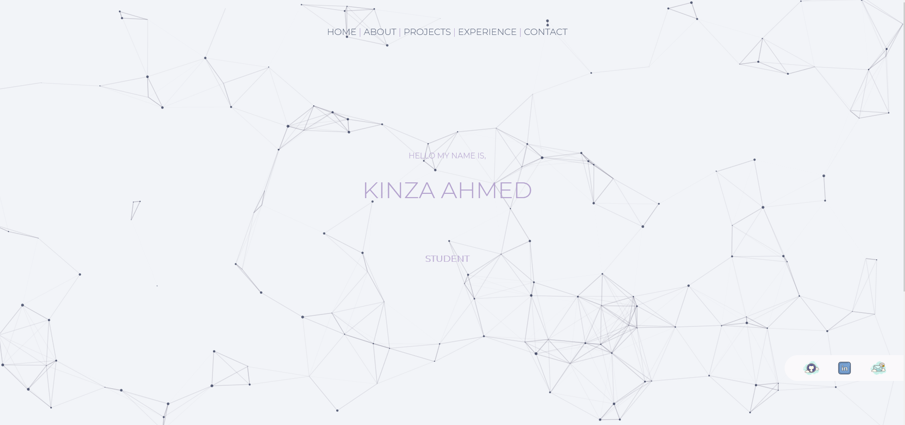

[![LinkedIn][linkedin-shield]][linkedin-url]

<!-- PROJECT LOGO -->
 

  

  <h3 align="center">Portfolio Website</h3>

  

    My interactive personal portfolio!
     
    <a href="https://kinzaahmed-web.github.io/PortfolioWebsite/"><strong>Explore the docs »</strong></a>
     
     
    <a href="https://kinzaahmed-web.github.io/PortfolioWebsite/#/">Checkout my portfolio</a>
    ·
    <a href="https://kinzaahmed-web.github.io/PortfolioWebsite/issues">Report Bug</a>
    ·
    <a href="https://kinzaahmed-web.github.io/PortfolioWebsite/issues">Request Feature</a>
  

  

Image Sources: All images for the projects were downloaded from wallpapercave.com   
Icon was downloaded from thenounproject.com

<!-- CONTACT -->
## Contact

Kinza Ahmed  - kinza1013@yahoo.com

Project Link: [https://kinzaahmed-web.github.io/PortfolioWebsite/](https://kinzaahmed-web.github.io/PortfolioWebsite/)

<!-- MARKDOWN LINKS & IMAGES -->
[linkedin-shield]: https://img.shields.io/badge/-LinkedIn-black.svg?style=for-the-badge&logo=linkedin&colorB=555
[linkedin-url]: https://linkedin.com/in/kinzaahmed/
 

# PortfolioWebsite

This project was generated with [Angular CLI](https://github.com/angular/angular-cli) version 11.2.7.

## Development server

Run `ng serve` for a dev server. Navigate to `http://localhost:4200/`. The app will automatically reload if you change any of the source files.

## Code scaffolding

Run `ng generate component component-name` to generate a new component. You can also use `ng generate directive|pipe|service|class|guard|interface|enum|module`.

## Build

Run `ng build` to build the project. The build artifacts will be stored in the `dist/` directory. Use the `--prod` flag for a production build.

## Running unit tests

Run `ng test` to execute the unit tests via [Karma](https://karma-runner.github.io).

## Running end-to-end tests

Run `ng e2e` to execute the end-to-end tests via [Protractor](http://www.protractortest.org/).

## Further help

To get more help on the Angular CLI use `ng help` or go check out the [Angular CLI Overview and Command Reference](https://angular.io/cli) page.
